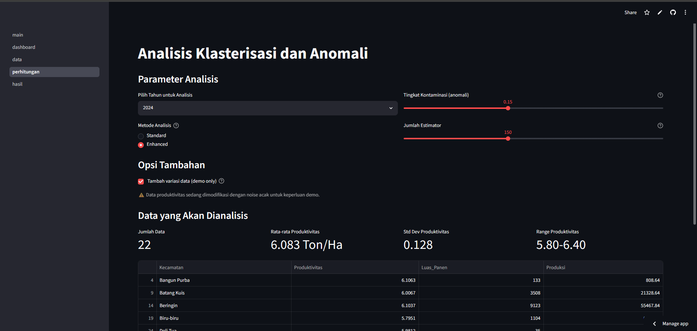
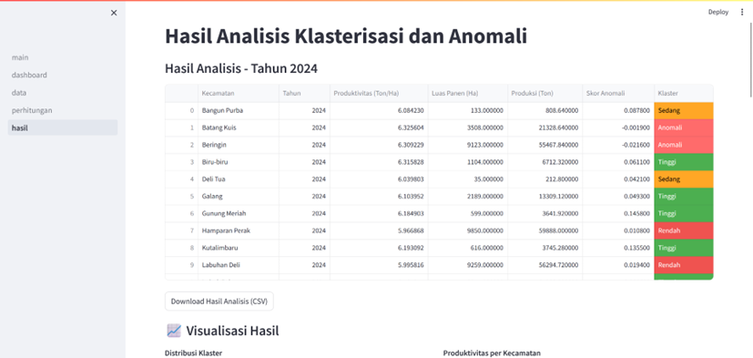
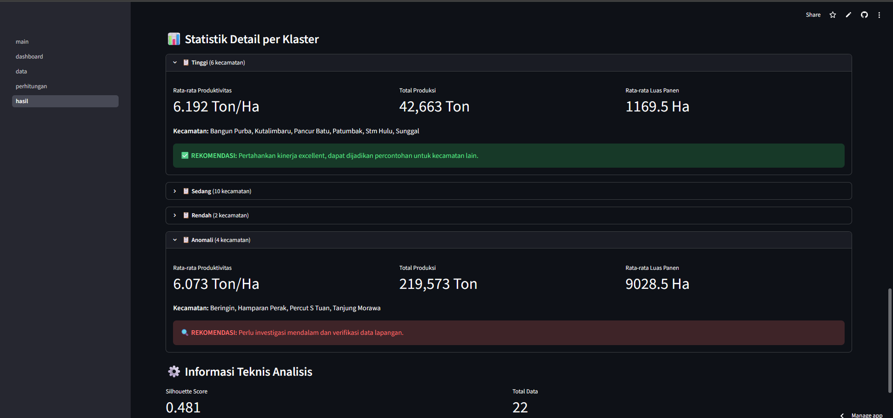

# Klasterisasi Produktivitas Padi

Aplikasi web untuk mengelompokkan 22 kecamatan di Kabupaten Deli Serdang berdasarkan produktivitas padi, sekaligus mendeteksi kecamatan dengan pola produksi yang tidak wajar, menggunakan Isolation Forest dan K-Means. Dibangun sebagai proyek skripsi (Teknik Informatika, Universitas Malikussaleh), dengan fokus mengubah lima tahun data mentah laporan Dinas Pertanian menjadi sesuatu yang bisa langsung dipakai untuk pengambilan kebijakan.

**Demo:** [Klasterisasi Padi](https://rice-clustering-deliserdang.streamlit.app/)

**Dashboard**



## Latar belakang

Dinas Pertanian menerbitkan laporan panen tahunan per kecamatan, tapi dari spreadsheet mentahnya sulit langsung terlihat kecamatan mana yang tertinggal, mana yang datanya janggal dan perlu ditelusuri, dan mana yang polanya bagus untuk dijadikan contoh. Aplikasi ini mengubah data mentah tersebut jadi alat klasterisasi interaktif: pilih tahun, atur parameter model, lalu dapatkan kecamatan yang terkelompok menjadi Tinggi / Sedang / Rendah, plus kelompok terpisah untuk data yang terdeteksi sebagai anomali.

## Cara kerja

1. **Ingesti data** : Mem-parsing format laporan Dinas Pertanian (12 bulan × 3 variabel per kecamatan) langsung dari CSV, menghitung produktivitas sebagai Produksi ÷ Luas Panen, dan memvalidasinya terhadap rentang yang realistis (dengan koreksi otomatis untuk laporan yang satuannya kuintal, bukan ton).
2. **Agregasi** : Data bulanan digabung jadi total tahunan per kecamatan, menggunakan rata-rata tertimbang berdasarkan luas panen, bukan rata-rata sederhana dari rasio bulanan.
3. **Deteksi anomali** : Isolation Forest memberi skor ke setiap kecamatan berdasarkan produktivitas, luas panen, dan volume produksi; persentase dengan skor terendah (bisa diatur, default 15%) ditandai sebagai anomali.
4. **Klasterisasi** : Kecamatan yang tersisa dikelompokkan dengan K-Means (2-3 klaster) dan diberi label Tinggi/Sedang/Rendah berdasarkan produktivitas aktualnya, jadi labelnya selalu konsisten dengan angka, bukan ID klaster acak.
5. **Pelaporan** : Hasil, grafik, dan rekomendasi kebijakan per klaster, semuanya bisa diekspor ke CSV.

**Hasil Analisis**




## Fitur

- Autentikasi berbasis sesi (kredensial bisa diganti lewat Streamlit secrets, lihat bagian di bawah)
- Tampilan data tahunan dan bulanan dengan filter serta ekspor CSV
- Parameter Isolation Forest yang bisa diatur (tingkat kontaminasi, jumlah estimator)
- Visualisasi klaster dan anomali: pie chart, bar chart terurut, scatter plot
- Statistik per klaster beserta teks rekomendasi kebijakan

## Teknologi

| Layer | Tools |
|---|---|
| Antarmuka aplikasi | Streamlit |
| Pengolahan data | pandas, NumPy |
| Pemodelan | scikit-learn (IsolationForest, KMeans, StandardScaler) |
| Visualisasi | Matplotlib |

## Struktur proyek

```
.
├── main.py                  # entry point: autentikasi + navigasi
├── auth.py                  # login (baca kredensial dari st.secrets/env var)
├── pages/
│   ├── 1_dashboard.py       # ringkasan + tren tahunan
│   ├── 2_data.py            # browser data tahunan/bulanan
│   ├── 3_perhitungan.py     # parameter klasterisasi + eksekusi
│   └── 4_hasil.py           # hasil, grafik, rekomendasi
├── utils/
│   ├── data_loader.py       # parsing CSV + agregasi
│   └── anomaly_detector.py  # pipeline Isolation Forest + KMeans
├── data/                    # laporan CSV tahunan (2020-2024)
└── requirements.txt
```

## Menjalankan secara lokal

```bash
git clone https://github.com/ardiwirya/rice-productivity-clustering.git
cd rice-productivity-clustering
pip install -r requirements.txt
streamlit run main.py
```

Aplikasi terbuka di `http://localhost:8501`. Login demo default: `admin` / `admin123` (lihat bagian **Kredensial** untuk mengubahnya sebelum di-deploy ke publik).

### Kredensial

Kredensial login tidak lagi ditulis langsung di kode. Atur salah satu cara berikut:

**Opsi A — Streamlit secrets (disarankan)**
```bash
cp .streamlit/secrets.toml.example .streamlit/secrets.toml
# edit .streamlit/secrets.toml dengan username/password sendiri
```

**Opsi B — environment variable**
```bash
export APP_USERNAME=usernamekamu
export APP_PASSWORD=passwordkamu
```

Kalau keduanya tidak diset, aplikasi otomatis pakai kredensial demo di atas supaya tetap bisa langsung dicoba.

## Deploy

Aplikasi ini berbasis Python/Streamlit, jadi memerlukan hosting yang menjalankan proses backend — bukan hosting statis seperti Netlify atau Vercel. Opsi yang kompatibel:

- **Streamlit Community Cloud** (gratis, paling sederhana) — hubungkan akun GitHub di [share.streamlit.io](https://share.streamlit.io), pilih repo ini, main file `main.py`, deploy.
- **Hugging Face Spaces** — buat Space baru dengan SDK "Streamlit".
- **Render** — buat Web Service baru dari repo GitHub dengan start command `streamlit run main.py --server.port $PORT --server.address 0.0.0.0`.

## Dataset

Lima laporan CSV tahunan (2020-2024) dari Dinas Pertanian Kabupaten Deli Serdang, mencakup 22 kecamatan dengan data bulanan luas tanam, luas panen, dan volume produksi. Letakkan di folder `data/` menggunakan nama file yang sudah ada di repo ini.

## Catatan soal analisis

Ambang klasterisasi yang muncul di draf-draf awal proyek ini (misalnya "produktivitas > 6,2 ton/ha = Tinggi") berlaku untuk satu kombinasi parameter dan satu tahun tertentu saja — angka itu akan bergeser tergantung tingkat kontaminasi dan jumlah estimator yang dipilih di aplikasi, karena keduanya langsung memengaruhi kecamatan mana yang ditandai anomali sebelum proses klasterisasi berjalan. Karena itu aplikasi selalu menghitung ulang dan menampilkan angkanya secara live, bukan hardcode.

Ada juga toggle "tambah variasi data (demo only)" di halaman Perhitungan yang menambahkan noise acak kecil pada produktivitas sebelum dianalisis — ini hanya untuk keperluan demo pada data yang sangat homogen, dan defaultnya nonaktif supaya hasil yang ditampilkan mencerminkan data asli.

## Lisensi

Dibuat untuk keperluan akademik (skripsi, Teknik Informatika, Universitas Malikussaleh). Penggunaan di luar itu mohon menyertakan atribusi kepada penulis asli.

## Kontak

**Ardi Wirya Indarto**
Teknik Informatika, Universitas Malikussaleh
[LinkedIn](https://id.linkedin.com/in/ardiwiryaindarto) · ardiwiryaindarto1@gmail.com
